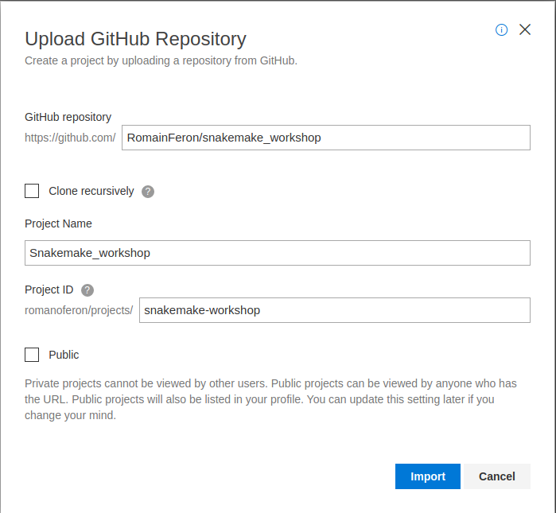
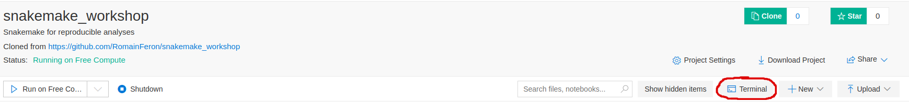
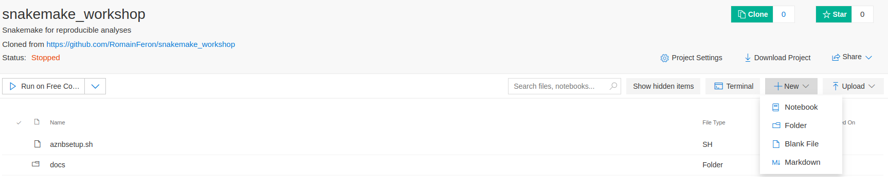

# Snakemake for reproducible analyses

This repository is used as a base for the workshop "Snakemake for reproducible analyses" by Amina Echchiki and Romain Feron. It contains:

- A setup script for Azure Notebooks
- A conda environment with all the dependencies required during the workshop
- Properly implemented solutions for all exercises
- A 'workflow' directory in which participants will implement the exercises, which contains sample data

The structure of the workshop loosely follows that of the official [Snakemake tutorial](https://snakemake.readthedocs.io/en/v5.6.0/tutorial/tutorial.html), with a few modifications.

All the exercises and material required to complete them are available on the repository's [wiki](https://github.com/RomainFeron/snakemake_workshop/wiki).

To complete the workshop's exercises, you have two choices:

- **Locally**: requires setting up Conda and Snakemake on your own machine, which will be helpful in the future. Instructions to setup Conda, Snakemake, and the workshop's environment are provided [here](#setup-locally).

- **Azure notebooks**: requires a microsoft account and a small setup step. It is easier than setting snakemake up locally, but will be less helpful in the future. Instructions to create an Azure Notebook for the workshop are provided [here](#setup-on-azure-notebooks).

## Setup locally

### Installing Conda

**Download the installer script and run it:**

*Linux:*

```bash
wget https://repo.continuum.io/miniconda/Miniconda3-latest-Linux-x86_64.sh
bash Miniconda3-latest-Linux-x86_64.sh
```

*MacOS:*

```bash
wget curl https://repo.continuum.io/miniconda/Miniconda3-latest-MacOSX-x86_64.sh -o Miniconda3-latest-MacOSX-x86_64.sh
bash bash Miniconda3-latest-MacOSX-x86_64.sh
```

**Follow instructions from the prompt:**

- Accept the License agreement (`yes`)
- Chose the installation path (default is `/home/<user>/miniconda3`)
- Wait for the packages to be installed (this can take some time)
- Chose whether the installer should initialize conda for your shell (recommended: `yes`)

**Restart your shell:**

```bash
source ~/.bashrc
```

**Note:** If you're not using bash as your shell, source the appropriate file (*e.g.* `~/.zshrc` if you're using zsh)

To verify that the installation process completed correctly, run:

```bash
conda env list
```

The output should look like this (username and hostname will be different):

```bash
(base) nbuser@nbserver:~$ conda env list
# conda environments:
#
base                  *  /home/nbuser/miniconda3
```

**Update conda:**

The Conda version from the official installer is not always the latest update. To make sure Conda is up-to-date, run:

```bash
conda update conda
```

### Clone the workshop's repository

**With SSH (recommended if you set it up):**

```bash
git clone git@github.com:RomainFeron/snakemake_workshop.git
```

**With HTTPS (default, no setup required):**

```bash
git clone https://github.com/RomainFeron/snakemake_workshop.git
```

### Create a Conda environment with all software required by the workshop

We provide an environment file `workshop.yaml` that contains all software required to complete the workshop.

Navigate to the workshop's base directory. If you followed the previous instructions exactly, you can do with:

```bash
cd snakemake_workshop
```

Create the conda environment from the environment file:

```bash
conda env create -f workshop.yaml
```

This step usually takes some time (up to 20-30 minutes), as there is a lot of dependencies to install.

Once the environment is created, activate it with:

```bash
conda activate snakemake-workshop
```

You can now run Snakemake and complete the workshop's exercises.

### Additional note: creating an Conda environment for Snakemake

This step is not part of the setup process, but if you want to use Snakemake by yourself in the future, the recommended way to run it is to create a conda environment specifically for Snakemake:

```bash
# Create a new empty environment called "snakemake-env"
conda env create --name snakemake-env
# Activate the environment "snakemake-env"
conda activate snakemake-env
# Install snakemake from the Bioconda channel (conda-forge contains dependencies)
conda install -c conda-forge -c bioconda snakemake
```

You can now activate the environment snakemake-env and run snakemake from it. It is advised to keep the environment as clean as possible, *i.e.* only install software related to running snakemake in general, not software specifically for your workflow.

## Setup on Azure Notebooks

### Creating a Notebook for the workshop

**Register for Azure Notebooks**

Log into Azure Notebooks at https://notebooks.azure.com/account/signin. You will need a Microsoft account for that; if you do not have one, create one following the link on the sign-in page. If you already have a Github account, you can use it to speed up the process.

**Create a new project**

Once you're logged in, go to your projects' page by clicking the `My projects` tab in the top-left menu:


Then, create a new project from the Github Repository by clicking the `Upload GitHub Repo` button in the right menu:


Fill the form:

- GitHub repository: `RomainFeron/snakemake_workshop`
- Project Name and ID: chose what you want
- Leave the boxes unticked



Click "import"; the project will now appear in the list, with the name you chose. After the import process is complete, start a free compute instance for the project by clicking the `Terminal` button:



A standard terminal with bash shell will be launched in a new browser tab. A message warning you that the container is being prepared should pop up, you can click "OK".

**The instance will be initialized with a script that setup the workshop's environment (aznbsetup.sh). This process can take up to 30 minutes to complete.**
**Instances are reset after 1 hour of inactivity. If you plan to run the workshop from an Azure Notebook instance, please start the instance at the very beginning of the workshop or even a bit before if you can, so that you can start the first exercises session on time !**

To verify that the setup process is complete, check the end of the relevant log file with the command `tail .nb.setup.log`. If the setup process is complete, you should see the following text:

```
# To activate this environment, use
#
#     $ conda activate snakemake-workshop
#
# To deactivate an active environment, use
#
#     $ conda deactivate
```

If another message is displayed, the setup process has not been completed yet; you can start creating and editing files but you won't be able to run Snakemake yet.

After the setup process is completed, update your bash environment with the command `source .bashrc`. Then, test your setup by activating the workshop's conda environment with the command `conda activate snakemake-workshop`.

### Creating and editing files

You can create a new file from the project's main page (https://notebooks.azure.com/<your_account_name>/projects/snakemake-workshop) by clicking the `+New` button and selecting `Blank File`:



You can then edit this file directly from the web interface by selecting it and clicking the `Edit` button on the file's preview page.

Alternatively, you can create and edit files locally using your preferred text editor and upload them to the project using the `Upload` button next to the `+New` button.

### Running Snakemake

Start a terminal and activate the workshop's conda environment as described in the Setup section, then navigate to the proper directory and simply run `snakemake`.
